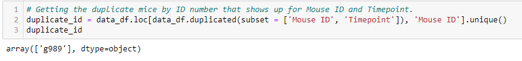
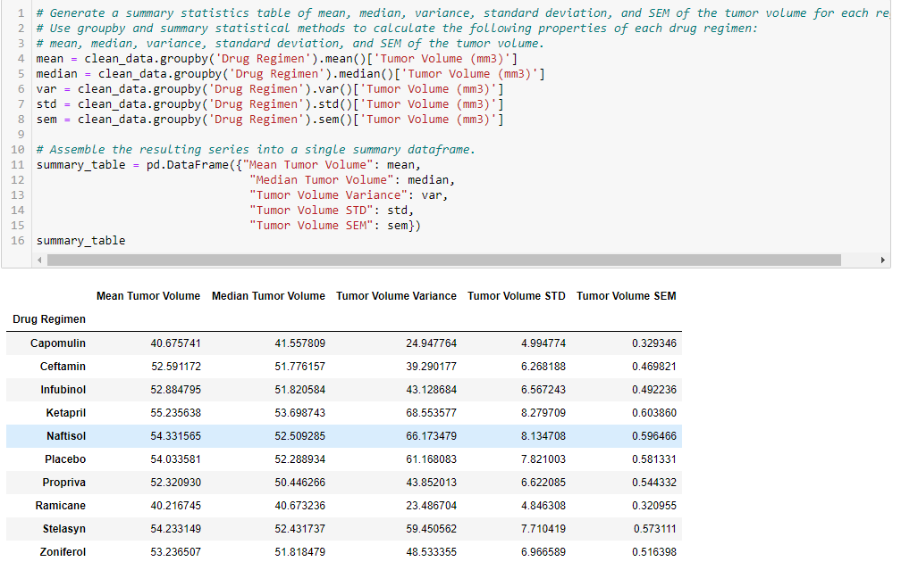
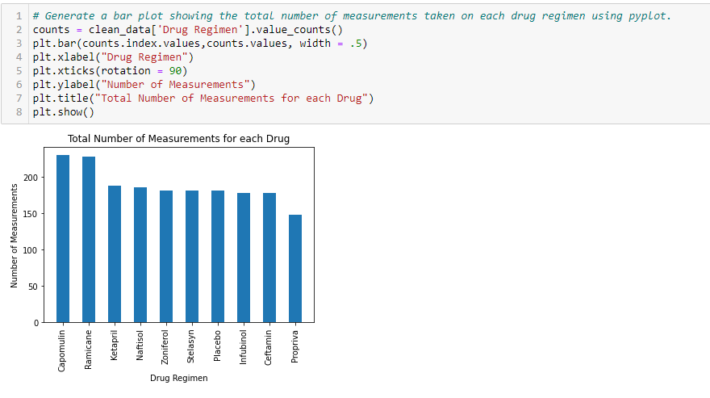
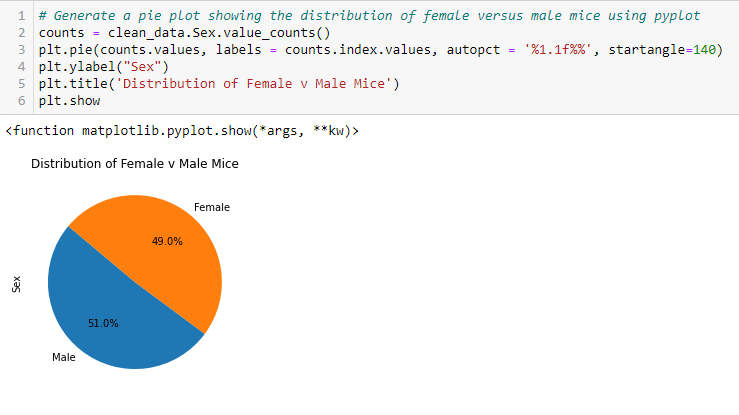
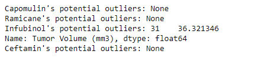
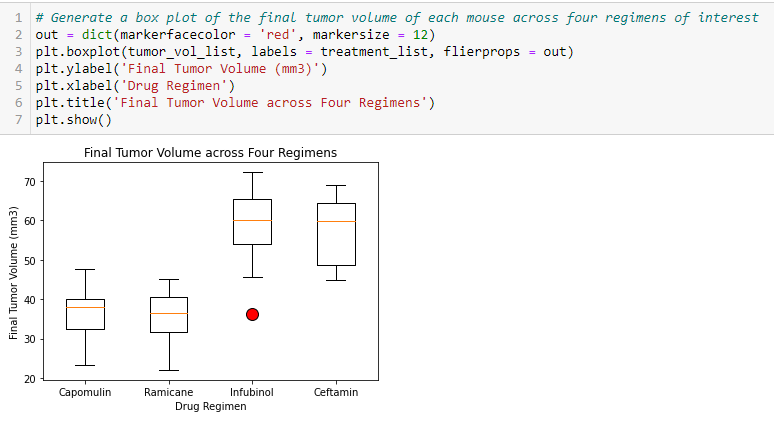
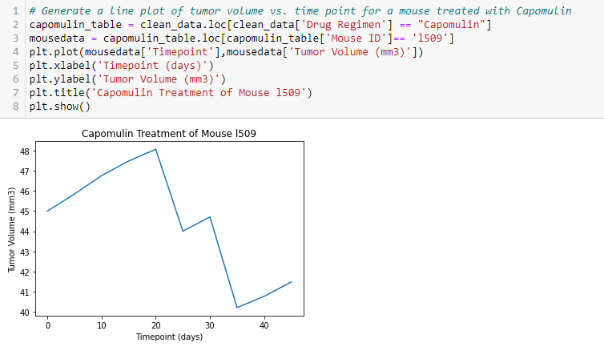
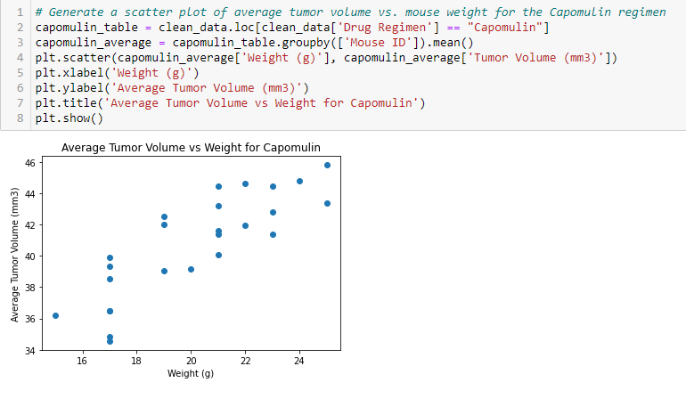
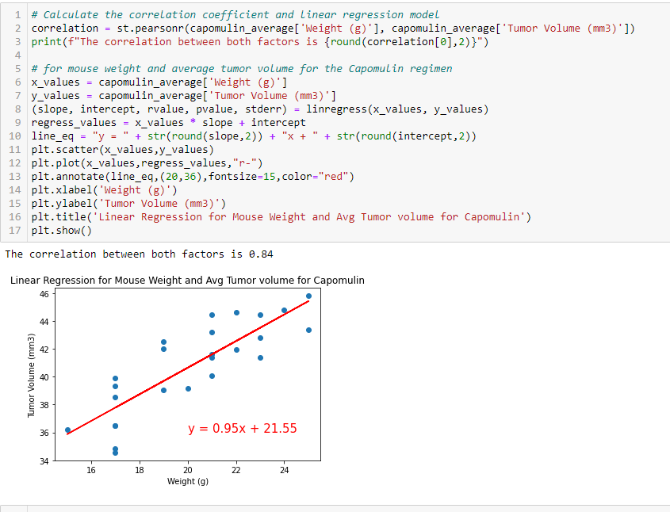

# Matplotlib Homework - The Power of Plots

## Background

While your data companions rushed off to jobs in finance and government, you remained adamant that science was the way for you. Staying true to your mission, you've joined Pymaceuticals Inc., a burgeoning pharmaceutical company based out of San Diego. Pymaceuticals specializes in anti-cancer pharmaceuticals. In its most recent efforts, it began screening for potential treatments for squamous cell carcinoma (SCC), a commonly occurring form of skin cancer.

As a senior data analyst at the company, you've been given access to the complete data from their most recent animal study. In this study, 249 mice identified with SCC tumor growth were treated through a variety of drug regimens. Over the course of 45 days, tumor development was observed and measured. The purpose of this study was to compare the performance of Pymaceuticals' drug of interest, Capomulin, versus the other treatment regimens. You have been tasked by the executive team to generate all of the tables and figures needed for the technical report of the study. The executive team also has asked for a top-level summary of the study results.

## Assignment

Your tasks are to do the following:

Your tasks are to do the following:
  * Check the data for any mouse ID with duplicate time points and remove any data associated with that mouse ID.
  
  

  * Generate a summary statistics table consisting of the mean, median, variance, standard deviation, and SEM of the tumor volume for each drug regimen.
  
  
 
  * Generate a bar plot using both Pandas's `DataFrame.plot()` and Matplotlib's `pyplot` that shows the total number of measurements taken for each treatment         regimen throughout the course of the study.
  
  
  
  * Generate a pie plot using both Pandas's `DataFrame.plot()` and Matplotlib's `pyplot` that shows the distribution of female or male mice in the study.
  
  
  
  * Calculate the final tumor volume of each mouse across four of the most promising treatment regimens: Capomulin, Ramicane, Infubinol, and Ceftamin. Calculate     the quartiles and IQR and quantitatively determine if there are any potential outliers across all four treatment regimens.
  
  
  
  * Using Matplotlib, generate a box and whisker plot of the final tumor volume for all four treatment regimens and highlight any potential outliers in the plot     by changing their color and style.
  
  

  * Select a mouse that was treated with Capomulin and generate a line plot of tumor volume vs. time point for that mouse.
  
  

  * Generate a scatter plot of mouse weight versus average tumor volume for the Capomulin treatment regimen.
  
  

  * Calculate the correlation coefficient and linear regression model between mouse weight and average tumor volume for the Capomulin treatment. Plot the linear     regression model on top of the previous scatter plot.
  
  

## Observations
* The correlation coefficent for mouse weight and average tumor volume for the Capomulin regimen is 0.842. This is a strong positve correlation, revealing the strong relationship between weight and tumor volume. As weight increases it is highy likely that tumor volume will increase as well.
* Capomulin and Ramicane had the most unique measurements taken, lowest average final tumor volumes, as well as the lowest standard deviation, making them the best candidates of the group.
* The sex of the mice was 51% male and 49% female. This is a good even division to allow us to further evaluate the data.
* The cleaned data revealed a total of 248 unique mice with a combined total of 1880 unique entries.

